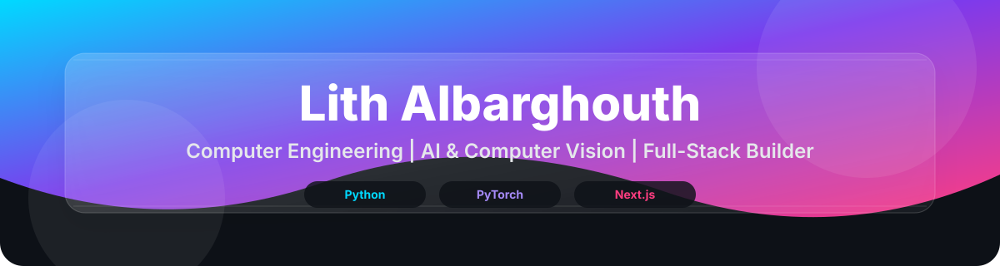
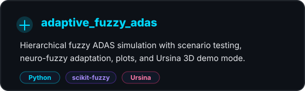
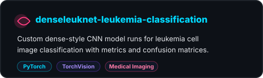
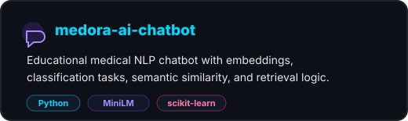
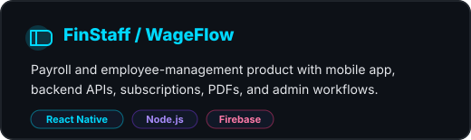
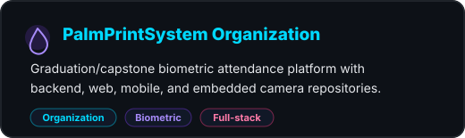
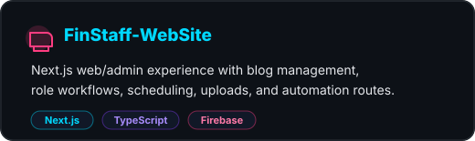

<div align="center">



<a href="https://github.com/LITH-ALBARGHOUTH">
  
</a>

<p>
  <a href="https://github.com/LITH-ALBARGHOUTH">
    
  </a>
  <a href="https://www.linkedin.com/in/lith-albarghouth-385336255">
    
  </a>
  
</p>

</div>

---

<table>
<tr>
<td width="60%" valign="top">

## About Me

```yaml
name: Lith Albarghouth
field: Computer Engineering
focus:
  - Artificial intelligence
  - Computer vision
  - Natural language processing
  - Full-stack and mobile systems
building:
  - biometric attendance systems
  - medical NLP prototypes
  - vision-based automation tools
  - production-style web/mobile platforms
```

- I like turning AI experiments into usable software with APIs, dashboards, and mobile flows.
- My strongest project areas are biometric recognition, medical AI/NLP, computer vision, simulation, and product engineering.
- I work across Python, PyTorch, FastAPI, Next.js, React Native, Node.js, Firebase/Supabase, and embedded camera workflows.

</td>
<td width="40%" valign="top">

## Current Focus

<p align="center">
  
  
  
</p>

```text
Computer Vision  -> palmprint, microscopy, gestures
NLP              -> chatbot, embeddings, retrieval
Systems          -> APIs, auth, dashboards, mobile apps
Simulation       -> fuzzy logic, ADAS, Unity gameplay
```

</td>
</tr>
</table>

---

<div align="center">

## Tech Stack


<br />
<br />


</div>

---

## Technical Skills

<table>
<tr>
<td width="50%" valign="top">

### AI & Machine Learning

`Model Training` `Deep Learning` `Data Preprocessing` `Model Evaluation` `Custom CNNs` `Image Classification` `Biometric Recognition` `Authentication & Verification Systems`

### ML Libraries

`PyTorch` `TorchVision` `scikit-learn` `NumPy` `Pandas` `SciPy` `Joblib` `Matplotlib`

</td>
<td width="50%" valign="top">

### Natural Language Processing

`Medical NLP` `Chatbot Workflows` `Text Classification` `Semantic Similarity` `Retrieval-Based Logic` `TF-IDF` `Sentence Embeddings` `Top-K Retrieval`

### NLP Models & Methods

`Sentence-Transformers` `Multilingual MiniLM` `LinearSVC` `Logistic Regression` `Complement Naive Bayes` `Cosine Similarity`

</td>
</tr>
<tr>
<td width="50%" valign="top">

### Computer Vision

`ROI Extraction` `Image Processing` `Palmprint Recognition` `Microscopy Image Classification` `Gesture Recognition` `Face/Hand Landmark Analysis` `Data Augmentation`

### Vision & Browser AI

`OpenCV` `YOLO` `MediaPipe Tasks Vision` `Chrome Manifest V3` `HTML5 Video Control` `Local Webcam Processing`

</td>
<td width="50%" valign="top">

### Training & Evaluation

`AdamW` `Learning-Rate Scheduling` `Early Stopping` `Label Smoothing` `Dropout` `CUDA / Google Colab` `Confusion Matrices` `Classification Reports` `Weighted F1` `Macro F1`

### AI Systems & Simulation

`Fuzzy Logic` `Mamdani Inference` `Neuro-Fuzzy Adaptation` `ADAS Simulation` `Scenario Testing` `scikit-fuzzy` `Ursina 3D`

</td>
</tr>
<tr>
<td width="50%" valign="top">

### Backend & APIs

`FastAPI` `Node.js` `Express.js` `REST APIs` `JWT Auth` `bcrypt` `Firebase Admin` `Supabase Auth` `Firestore` `Validation` `Rate Limiting`

### Full-Stack Web

`Next.js` `React` `TypeScript` `JavaScript` `Tailwind CSS` `Bootstrap` `Admin Dashboards` `Role-Based Workflows`

</td>
<td width="50%" valign="top">

### Mobile, Embedded & Product

`React Native` `Expo` `Mobile Auth` `Push Notifications` `RevenueCat` `PDF Generation` `Scheduled Jobs` `ESP32-S3 Camera` `Arduino`

### Tools & Game Development

`Git` `GitHub` `VS Code` `Postman` `Docker` `Unity` `C#` `NavMesh` `ScriptableObject` `Game UI`

</td>
</tr>
</table>

---

<div align="center">

## Featured Repositories

</div>

<table>
<tr>
<td width="50%">
  <a href="https://github.com/LITH-ALBARGHOUTH/adaptive_fuzzy_adas">
    
  </a>
</td>
<td width="50%">
  <a href="https://github.com/LITH-ALBARGHOUTH/denseleuknet-leukemia-classification">
    
  </a>
</td>
</tr>
<tr>
<td width="50%">
  <a href="https://github.com/LITH-ALBARGHOUTH/medora-ai-chatbot">
    
  </a>
</td>
<td width="50%">
  <a href="https://github.com/LITH-ALBARGHOUTH/FinStaff">
    
  </a>
</td>
</tr>
<tr>
<td width="50%">
  <a href="https://github.com/PalmPrintSystem/Palmprint-backend">
    
  </a>
</td>
<td width="50%">
  <a href="https://github.com/LITH-ALBARGHOUTH/FinStaff-WebSite">
    
  </a>
</td>
</tr>
</table>

---

<div align="center">

## GitHub Stats & Activity


<br />
<br />


</div>

---

<div align="center">

## GitHub Trophies


<br />
<br />


</div>
